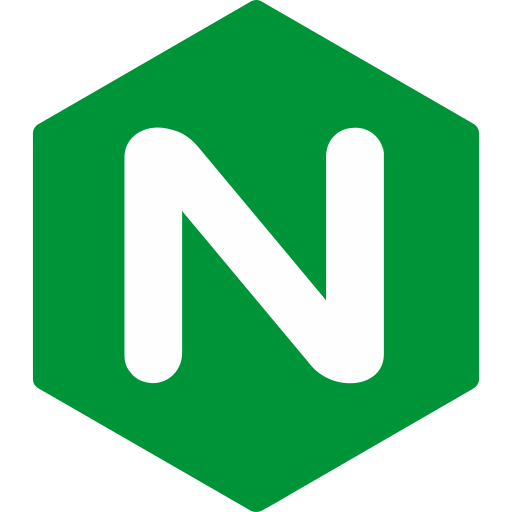

    <h1 align="center">
       
    </h1>
    
A back-end developer, doing some good stuff using python, flask and a few sever configurations. Check out my repositories for more.

    <ul>
        <li>
            Currently working on my <a href="https://github.com/Daniel02md/AngleMusic-API">api</a> for my music app and creating a AI, <a href="https://github.com/Daniel02md/CaptchaReader-AI">who reads captcha. </a>
        </li>
        <li>
            Also currently learning some things, as such as: Python for deep learning, Python for data science...
        </li>
    </ul>

    <h2>Places where you can find me:</h2>
    
    
    
    

 

    <h2>Technologies that i can absolutely work with: </h2>
    

        <h3>Frameworks and library stacks:</h3>
        
    

    

        <h3>Programming language stack:</h3>
        
        
        
        
    

    

        <h3>Database stack:</h3>
        
        
    

    

        <h3>DevOps stack:</h3>
        
        
        
        
    

    

        <h3>IDE stack:</h3>
        
    

<h3>Don't forget to checkout the repositories pinned down below ⬇</h3>
